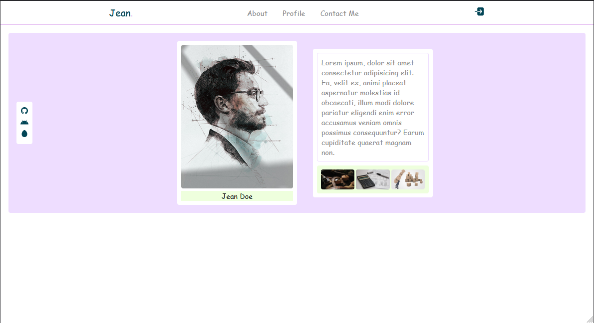

### responsive landing page using HTML & CSS | #jeandoe @mrvin100

Create a Stunning Landing Page with HTML & CSS

Simple web tutorial using html css and javascript by jeandoe.

This is a presentation video about How To Create a Stunning Landing Page with HTML & CSS only from scratch.
source code it's available for every one who want to use it by adding on their one website or to build, create or make another design of it !
and don't forget to shared it to help your friend !

the main feature of this website are:
✅ responsive header section.
✅ design home section.
✅ design social icons box.
✅ responsive design with flexbox.

